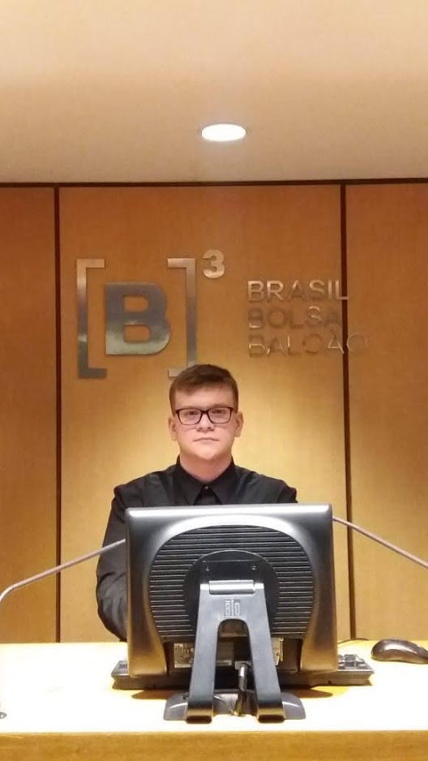

# Olá, Eu sou o **Lucas Nunes** 🐍 🌐 👩‍💻;)

 

### 👦 Sobre mim :
> * 👋 18 Aninhos.
> * 📌 Sou de Osasco, SP - Brasil.
> * 💬 Me chame Para falar sobre **Python**, Com certeza irei adorar ;)
> * 🛠️ Estou focando em Virar um **Cientista de dados**.
> * 🔭 Segredo: Já escrevi Alguns Contos & Poemas.
> * Sou Contra todo e qualquer tipo de discriminação!

### ⚡ Conhecimentos :
> *    

### 📦 DataBases & DataStorage:
> *    
### 🧰 Ferramentas:
> *    

 
 
 
 

---------------

### 💚 IDE'S:
> *   

### 🐧 OS:
> *  

### 📔 Publicando Artigos:
> *  

### Estatísticas gerais

### 📈  linguagens mais usadas

-------

##  Ei, Entre em **Contato Comigo!!** ;)

 
 
  
   
